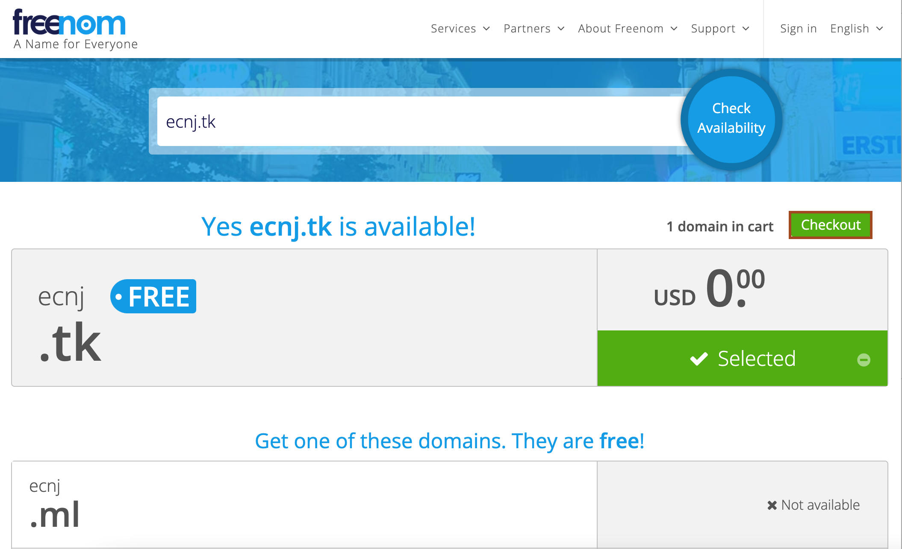
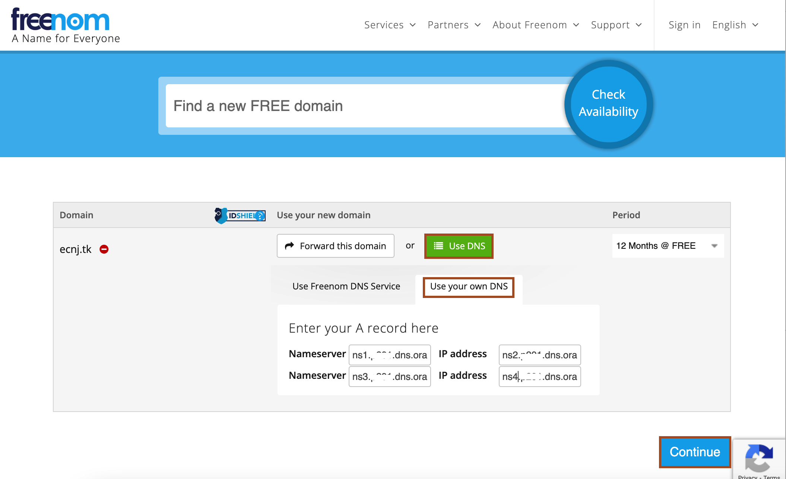
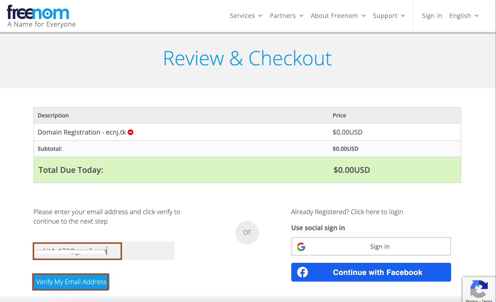
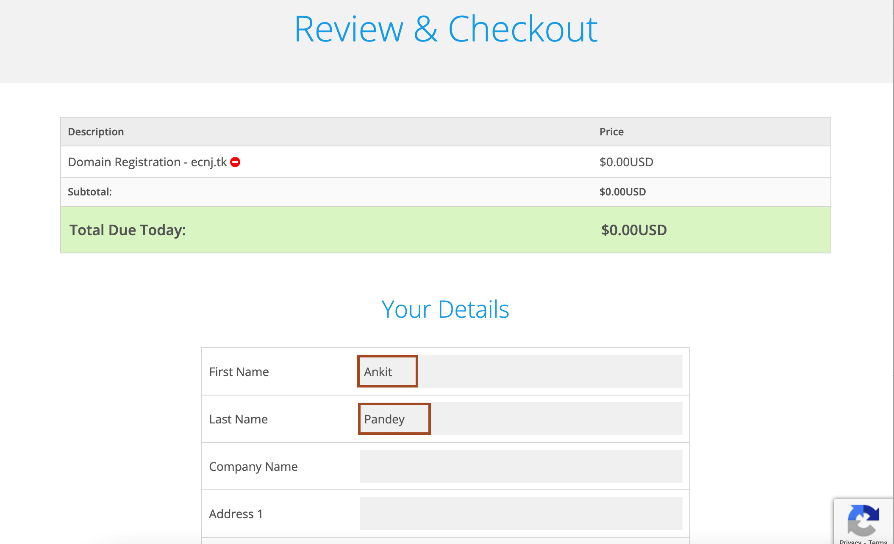

 # Register a domain name

 1. Open browser and paste the URL [Domain-Registration](https://www.freenom.com/).
 
 2. Enter the domain name and click on *Check Availability*. If you see that domain is available and it is selected then click *checkout*.
        

3. Click *Use DNS* and select *Use your own DNS* then enter the name of nameservers as shown. Click *Continue*.
        

4. Enter your email address and click *Verify My Email Address*.
    

5. Once your email address verify, you can sign in using your email id. 

6. Then you can click *View cart* to view your order.

7. Enter the required detail and complete the order.
    